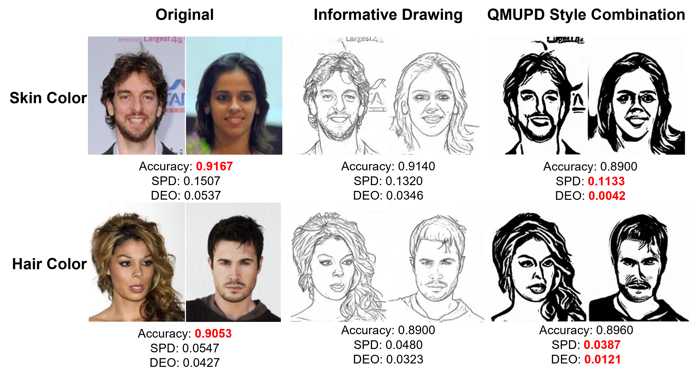

# EECE570-Final-Project
code for EECE570 Final Report "Improving Fairness in Image Classification via Sketching Style Combination"

Ruichen Yao

84951482


## Overall Pipeline

I convert the original input images into sketch style combined images instead of sketch images with only one style. Then I feed sketch style combined images to the following classification model for prediction. To further fairness improvement, I introduce a fairness loss function to mitigate the bias in the model.

## Sketching Method

For sketch generation model $S$, we employ the latest image-to-sketching method [Quality Metric Guided Portrait Line Drawing Generation From Unpaired Training Data
](https://ieeexplore.ieee.org/document/9699090) to convert input image $x_i$ into its corresponding sketch $S(x_i)$.

The code are available [here](https://github.com/yiranran/QMUPD).

## Usage
### Setup

Run the `./requirements.txt` with the following command to meet requirements.
```
pip install -r requirements.txt
```

The CelebA dataset can be downloaded [here](https://mmlab.ie.cuhk.edu.hk/projects/CelebA.html). The images should be stored at `./dataset/img_align_celeba/`

Run `./train_test_split.py` with the following command:
```
py train_test_split.py --img_type xxx --sensitive_type xxx --num xxx
```
You could adjust `--csv_dir`, `--data_dir`, `--img_dir`, `--img_type`, `--sensitive_type`, and `--num` in this file.

### Training
To train the model, you could run `./train_resnet.py` with the following command:
```
py train_resnet.py --target xxx --img_type xxx --sensitive_type xxx --fairloss x --batch_size x --max_epochs_stop x --num_epochs x --learning_rate x
```
You could adjust `--target`, `--img_type`, `--sensitive_type`, `--batch_size`, `--max_epochs_stop`, `--num_epochs`, `--fairloss`, and `--learning_rate` in this file when training the model.

### Testing
The test results are available at `./Tesing_results_of_CelebA.ipynb`. You could directly view and run the test results using the existing model.

In addition, you could run `./train_resnet.py` with the following command to test the model.
```
py train_resnet.py --isTrain 0 --target xxx --img_type xxx --sensitive_type xxx --fairloss x
```
You could adjust `--target`, `--img_type`, `--sensitive_type`, and `--fairloss` in this file when testing the model.

## Evaluation Results

The result of sketch style combined images with $\mathcal{L}_{\rm fair}$ demonstrates that the fairness loss could further improve fairness. And these results are the best in terms of fairness, surpassing the previous results of Yao et al.[Improving Fairness in Image Classification viaSketching](https://arxiv.org/pdf/2211.00168.pdf).
